# Build AD FS plug-in to block authentication or enforce MFA based on user risk level determined by Azure AD Identity Protection

Build your own plug-in with [AD FS Risk Assessment Model](https://docs.microsoft.com/en-us/windows-server/identity/ad-fs/development/ad-fs-risk-assessment-model) that uses the risk level of a user determined by [Azure AD Identity Protection](https://docs.microsoft.com/en-us/azure/active-directory/identity-protection/overview-identity-protection) to allow or block authentication or enforce additional authentication (MFA) while authenticating the user againsts AD FS. 

The plug-in once registered with AD FS runs in line with AD FS authentication process. For any user authenticating against AD FS, the plug-in pulls in the Risk Level of the user using the Azure AD Identity Protection [riskyUser API](https://docs.microsoft.com/en-us/graph/api/resources/riskyuser?view=graph-rest-beta) and initiates one of the follwing actions
- Blocks authentication if user's risk level is “high”
- Enforces additional authentication (MFA) if user's risk level is “low” or “medium”
- Allows authentication if user's risk level is "none", "hidden" or "unknownFutureValue"

 >[!NOTE]
 >This sample is only to illustrate how cloud intelligence from Azure AD Identity Protection can be used to further strengthen the AD FS authentication process. By no means is the plug-in we are building an enterprise ready solution. 


## Prerequisites

- AD FS 2019 installed and configured
- Synchronize AD (on-prem) users with Azure AD using synchronization tools such as [Azure AD Connect](https://docs.microsoft.com/en-us/azure/active-directory/hybrid/whatis-azure-ad-connect)
-  Azure AD Premium P2 license to be able to call [riskyUser API](https://docs.microsoft.com/en-us/graph/api/resources/riskyuser?view=graph-rest-beta) (https://graph.microsoft.com/beta/riskyUsers)
- Configure additional authentication method for AD FS such as [Azure MFA](https://docs.microsoft.com/en-us/windows-server/identity/ad-fs/operations/configure-ad-fs-and-azure-mfa)
- .NET Framework 4.7 and above
- Visual Studio


## Setting up the sample

### Build plug-in dll 

The following procedure will walk you through building a sample plug-in dll.

1. Download the [sample](https://github.com/Microsoft/adfs-sample-RiskAssessmentModel-RiskyIPBlock)
  
2. Open the project `ThreatDetectionModule.sln` using Visual Studio

3. Remove the `Microsoft.IdentityServer.dll` from the Solutions Explorer as shown below:</br> </br>
   

4. Add reference to the `Microsoft.IdentityServer.dll` of your AD FS as shown below

   a.    Right click on **References** in **Solutions Explorer** and select **Add Reference…**</br> </br>
   
   
   b.    On the **Reference Manager** window select **Browse**. In the **Select the files to reference…** dialogue, select `Microsoft.IdentityServer.dll` from your AD FS installation folder (in my case **C:\Windows\ADFS**) and click **Add**.
   
   >[!NOTE]
   >In my case I am building the plug-in on the AD FS server itself. If your development environment is on a different server, copy the `Microsoft.IdentityServer.dll` from your AD FS installation folder on AD FS server on to your development box.</br> 
   
   
   
   c.    Click **OK** on the **Reference Manager** window after making sure `Microsoft.IdentityServer.dll` checkbox is selected</br> </br>
   
 
5. Open **RiskyUserHelper.cs** from the **Solutions Explorer** to update the Azure AD tenant name, Client ID and Client Secret </br> </br>
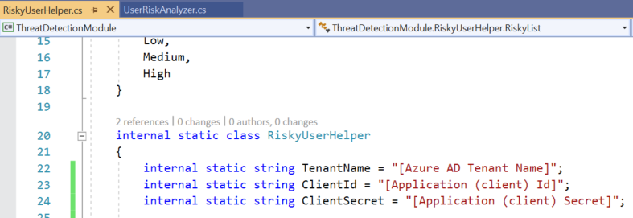

   </br> To get these perform the following steps as Administrator in **[Azure Portal](https://portal.azure.com/)**
   
   a.    To get **Azure AD tenant name**, go to **[Azure Active Directory](https://portal.azure.com/#blade/Microsoft_AAD_IAM/ActiveDirectoryMenuBlade/Overview)** blade and select **Properties** from the **Manage** section on the left navigation pane. (In my case the tenant name is fabtoso.com as shown under **Directory properties** in **Name** field)</br> </br>
   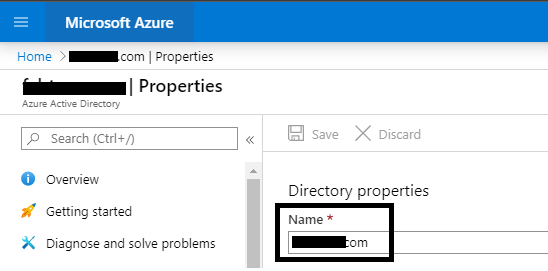
   
   b.    To get the **Client ID** we first need to register the plug-in in Azure Active Directory. To do so, go to **[App Registration](https://portal.azure.com/#blade/Microsoft_AAD_RegisteredApps/ApplicationsListBlade)**, click **New Registration** </br> </br>
   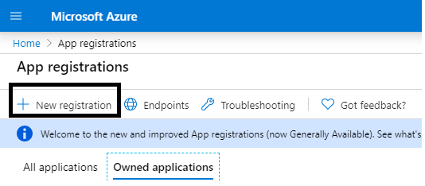

   On **New Registration**, enter a name for the plug-in and click **Register** (Note - For other fields, I am keeping the default values) </br> </br>
   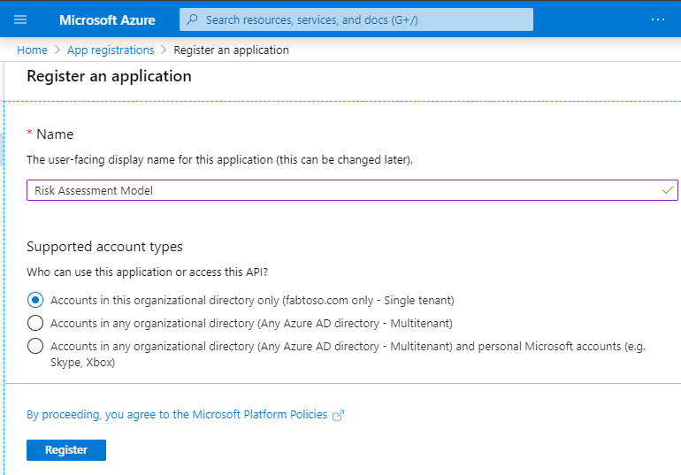

   Once registered, get the **Client ID** for the registered plug-in as shown below </br> </br>
   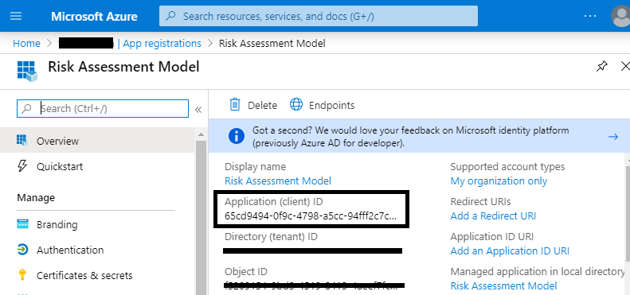

   c.    To get the **Client Secret** click **Certificates & secrets** from the **Manage** section on the left navigation pane as shown below </br> </br>
   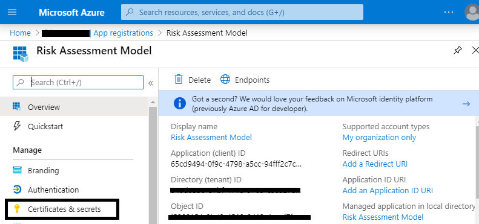
 
   On **Certificates & secrets** blade, click **New client secret** and follow the process to generate the secret </br> </br>
   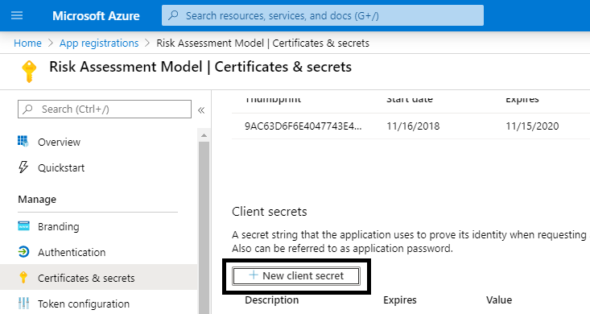

   Once generated, get the secret to update in the **RiskyUserHelper.cs** file. 

   d.    Though we have registered the plug-in in Azure Active Directory, we also need to provide it permission to call the Microsoft Graph API i.e. the riskyUser API
   
   To provide permission, click on **API permissions** from the **Manage** section on the left navigation pane. Then click **Add a permission** </br> </br>
   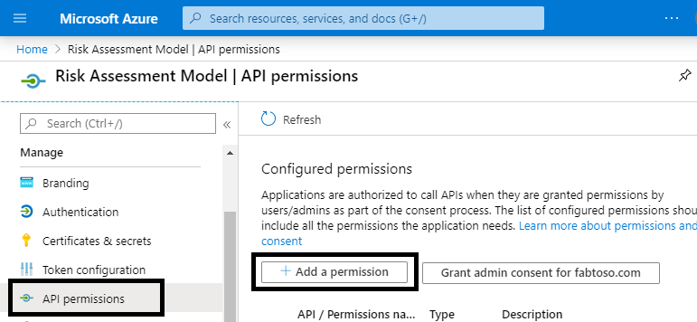

   On **Request API permissions** blade, select **Microsoft Graph** </br> </br>
   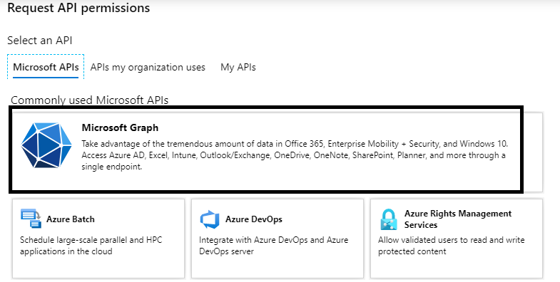

   Next, select **Application permissions** and search **identityriskyuser** under **Select permissions**. Select checkbox for **IdentityRiskyUser.Read.All** permission and click **Add permissions** </br> </br>
   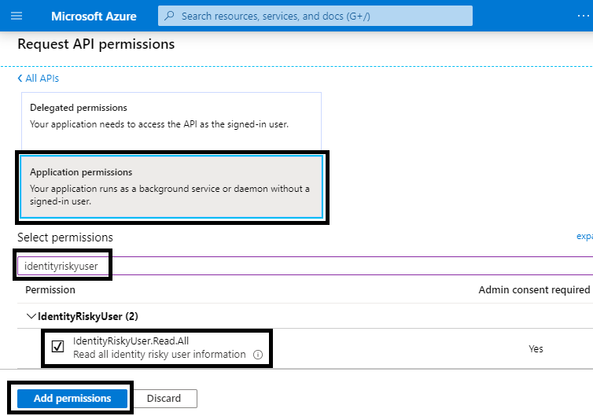

   Lastly, click on **API permissions** from the **Manage** section on the left navigation pane. Select the **IdentityRiskyUser.Read.All** permission row and click on **Grant admin consent for [tenant name]**. Click **Yes** </br> </br>
   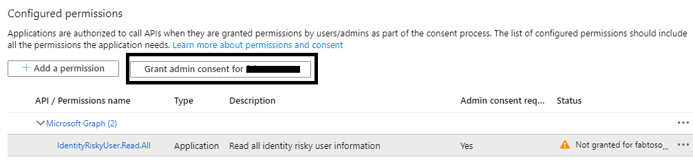


6. All the classes and references are now in place to do a build.   However, since the output of this project is a dll,  it will have to be installed into the **Global Assembly Cache**, or GAC, of the AD FS server and the dll needs to be signed first. This can be done as follows:

   a.    **Right-click** on the name of the project, ThreatDetectionModule. From the menu, click **Properties**.</br> </br>
   
   
   b.    From the **Properties** page, click **Signing**, on the left, and then check the checkbox marked **Sign the assembly**. From the **Choose a strong name key file**: pull down menu, select **<New...>**</br> </br>
   

   c.    In the **Create Strong Name Key dialogue**, type a name (you can choose any name) for the key, uncheck the checkbox **Protect my key file with password**. Then, click **OK** </br> </br>
   
 
   d.    Save the project as shown below</br> </br>
   

7. Build the project by clicking **Build** and then **Rebuild Solution** as shown below</br> </br>
   
 
   Check the **Output window**, at the bottom of the screen, to see if any errors occurred</br> </br>
   


The plug-in (dll) is now ready for use and is in the **\bin\Debug** folder of the project folder (In my case, that's **C:\extensions\ThreatDetectionModule\bin\Debug\ThreatDetectionModule.dll**). 

The next step is to register this dll with AD FS, so it runs in line with AD FS authentication process. 

### Register the plug-in dll with AD FS

We need to register the dll in AD FS by using the `Register-AdfsThreatDetectionModule` PowerShell command on the AD FS server, however, before we register, we need to get the Public Key Token. This public key token was created when we created the key and signed the dll using that key. To learn what the Public Key Token for the dll is, you can use the **SN.exe** as follows

1. Copy the dll file from the **\bin\Debug** folder to another location (In my case copying it to **C:\extensions**)

2. Start the **Developer Command Prompt** for Visual Studio and go to the directory containing the **sn.exe** (In my case the directory is **C:\Program Files (x86)\Microsoft SDKs\Windows\v10.0A\bin\NETFX 4.7.2 Tools**) </br> </br>
   

3. Run the **SN** command with the **-T** parameter and the location of the file (In my case `SN -T "C:\extensions\ThreatDetectionModule.dll"`) </br> </br>
   </br> </br>
   The command will provide you the public key token (For me, the **Public Key Token is 714697626ef96b35**)

4. Add the dll to the **Global Assembly Cache** of the AD FS server
   Our best practice would be that you create a proper installer for your project and use the installer to add the file to the GAC. Another solution is to use **Gacutil.exe** (more information on **Gacutil.exe** available [here](https://docs.microsoft.com/dotnet/framework/tools/gacutil-exe-gac-tool)) on your development machine.  Since I have my visual studio on the same server as AD FS, I will be using **Gacutil.exe** as follows

   a.    On Developer Command Prompt for Visual Studio and go to the directory containing the **Gacutil.exe** (In my case the directory is **C:\Program Files (x86)\Microsoft SDKs\Windows\v10.0A\bin\NETFX 4.7.2 Tools**)

   b.    Run the **Gacutil** command (In my case `Gacutil /IF C:\extensions\ThreatDetectionModule.dll`) </br> </br>
   
 
   >[!NOTE]
   >If you have an AD FS farm, the above needs to be executed on each AD FS server in the farm. 

5. Open **Windows PowerShell** and run the following command to register the dll
   ```
   Register-AdfsThreatDetectionModule -Name "<Add a name>" -TypeName "<class name that implements interface>, <dll name>, Version=10.0.0.0, Culture=neutral, PublicKeyToken=< Add the Public Key Token from Step 2. above>"
   ```
   In my case, the command is: 
   ```
   Register-AdfsThreatDetectionModule -Name "RiskyUserPlugin" -TypeName "ThreatDetectionModule.UserRiskAnalyzer, ThreatDetectionModule, Version=10.0.0.0, Culture=neutral, PublicKeyToken=714697626ef96b35"
   ```
 
   >[!NOTE]
   >You need to register the dll only once, even if you have an AD FS farm. 

6. Restart the AD FS service after registering the dll

That's it, the dll is now registered with AD FS and ready for use!

 >[!NOTE]
 > If any changes are made to the plugin and the project is rebuilt, then the updated dll needs to be registered again. Before registering, you will need to unregister the current dll using the following command:</br></br>
 >`
  UnRegister-AdfsThreatDetectionModule -Name "<name used while registering the dll in 5. above>"
 >`</br></br> 
 >In my case, the command is:
 >``` 
 >UnRegister-AdfsThreatDetectionModule -Name "RiskyUserPlugin"
 >```


### Configure MFA policies in AD FS

The last step in setting up the sample is to configure the policies in AD FS to trigger additional authentication (MFA) when the user risk level is either "low" or "medium". To do so, open **Windows PowerShell** on AD FS server and run the following command 
```
Set-AdfsRelyingPartyTrust -TargetName <Add Relying Party Name> -AdditionalAuthenticationRules exists([Type == "http://schemas.microsoft.com/ws/2017/04/identity/claims/riskscore", Value == "low"])=>issue(Type = "http://schemas.microsoft.com/ws/2008/06/identity/claims/authenticationmethod", Value = "http://schemas.microsoft.com/claims/multipleauthn"); exists([Type == "http://schemas.microsoft.com/ws/2017/04/identity/claims/riskscore", Value == "medium"])=>issue(Type = "http://schemas.microsoft.com/ws/2008/06/identity/claims/authenticationmethod", Value = "http://schemas.microsoft.com/claims/multipleauthn"); exists([Type == "http://schemas.microsoft.com/ws/2017/04/identity/claims/riskscore", Value == "high"])=>issue(Type = "http://schemas.microsoft.com/ws/2008/06/identity/claims/authenticationmethod", Value = "http://schemas.microsoft.com/claims/multipleauthn");
```
In my case, the command is: 
```
Set-AdfsRelyingPartyTrust -TargetName Calimsxray -AdditionalAuthenticationRules exists([Type == "http://schemas.microsoft.com/ws/2017/04/identity/claims/riskscore", Value == "low"])=>issue(Type = "http://schemas.microsoft.com/ws/2008/06/identity/claims/authenticationmethod", Value = "http://schemas.microsoft.com/claims/multipleauthn"); exists([Type == "http://schemas.microsoft.com/ws/2017/04/identity/claims/riskscore", Value == "medium"])=>issue(Type = "http://schemas.microsoft.com/ws/2008/06/identity/claims/authenticationmethod", Value = "http://schemas.microsoft.com/claims/multipleauthn"); exists([Type == "http://schemas.microsoft.com/ws/2017/04/identity/claims/riskscore", Value == "high"])=>issue(Type = "http://schemas.microsoft.com/ws/2008/06/identity/claims/authenticationmethod", Value = "http://schemas.microsoft.com/claims/multipleauthn");
```


## Running the sample

For this demonstration, I will be using [AD FS Help Claims X-Ray tool](https://adfshelp.microsoft.com/ClaimsXray) to initiate authentication request. If you would like to use the X-Ray tool, please follow the instructions in step 1 **Federation Services Configuration** to create a relying party trust for the service in your federation deployment. 

1. Enter federation server instance and hit **Test Authentication** in step 2 of Claims X-Ray tool</br> </br>
   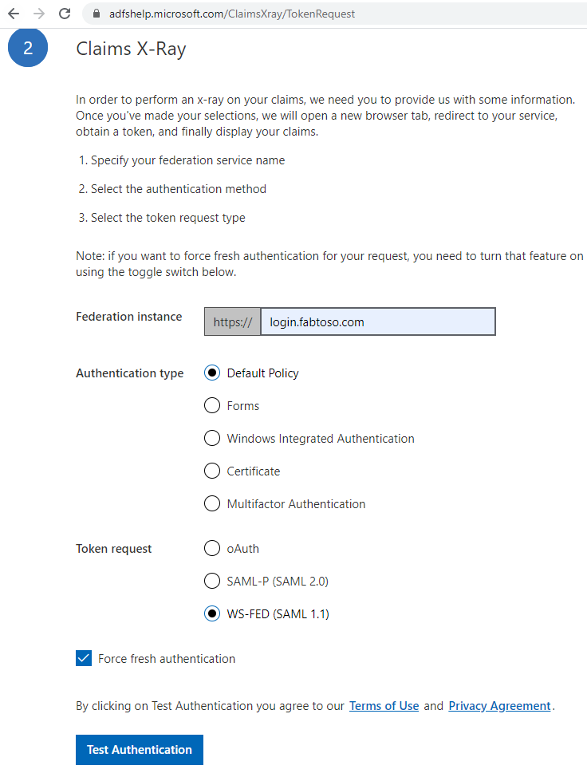

2. On the login page, enter the user id and password of a non risky user (risk level = none) </br> </br>
   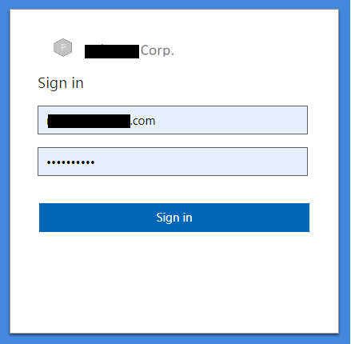

   The user should be able to log in. 

3. Repeat step 1 above and on the login page enter a user id and password of a low risk user (risk level = Low)

    >[!NOTE]
    >To check the risk level of a user, go to **[Risky users report](https://portal.azure.com/#blade/Microsoft_AAD_IAM/SecurityMenuBlade/RiskyUsers)** in Azure Portal.</br>
    >For testing purpose, to make a user risky (with risk level = Low) login with user credentials to Azure Portal from a [TOR browser](https://www.torproject.org/projects/torbrowser.html.en)

   The plug-in will trigger additional authentication as per the configuration (In my case I have configured Azure MFA) </br> </br>
   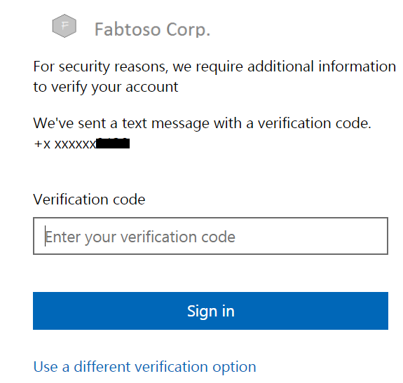

   Once authenticated, the user should be able to log in. 

4. Repeat step 1 above and on the login page enter a user id and password of a high risk user (risk level = High)

   >[!NOTE]
   >For testing purpose, to make a user risky (with risk level = High) login to **[Risky users report](https://portal.azure.com/#blade/Microsoft_AAD_IAM/SecurityMenuBlade/RiskyUsers)** in Azure Portal as an Administrator. Select the user you want to change the risk level to High and click **Confirm user compromised** </br> </br>
   >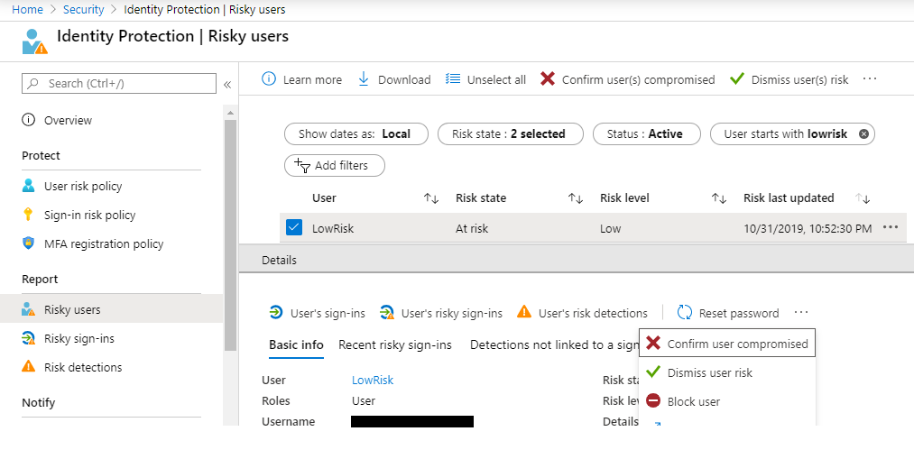

   The plug-in will block the user from authenticating </br> </br>
   

 >[!NOTE]
 >The sample plug-in gets the complete list of risky users for each authentication which can cause delay in authentication process. Therefore, the plug-in should be tested against an Azure AD tenant with a few number of users to avoid delays or should be optimized to use caching or [Get riskyUser method](https://docs.microsoft.com/en-us/graph/api/riskyusers-get?view=graph-rest-beta&tabs=http) 


## Contributing

This project welcomes contributions and suggestions.  Most contributions require you to agree to a
Contributor License Agreement (CLA) declaring that you have the right to, and actually do, grant us
the rights to use your contribution. For details, visit https://cla.opensource.microsoft.com.

When you submit a pull request, a CLA bot will automatically determine whether you need to provide
a CLA and decorate the PR appropriately (e.g., status check, comment). Simply follow the instructions
provided by the bot. You will only need to do this once across all repos using our CLA.

This project has adopted the [Microsoft Open Source Code of Conduct](https://opensource.microsoft.com/codeofconduct/).
For more information see the [Code of Conduct FAQ](https://opensource.microsoft.com/codeofconduct/faq/) or
contact [opencode@microsoft.com](mailto:opencode@microsoft.com) with any additional questions or comments.
